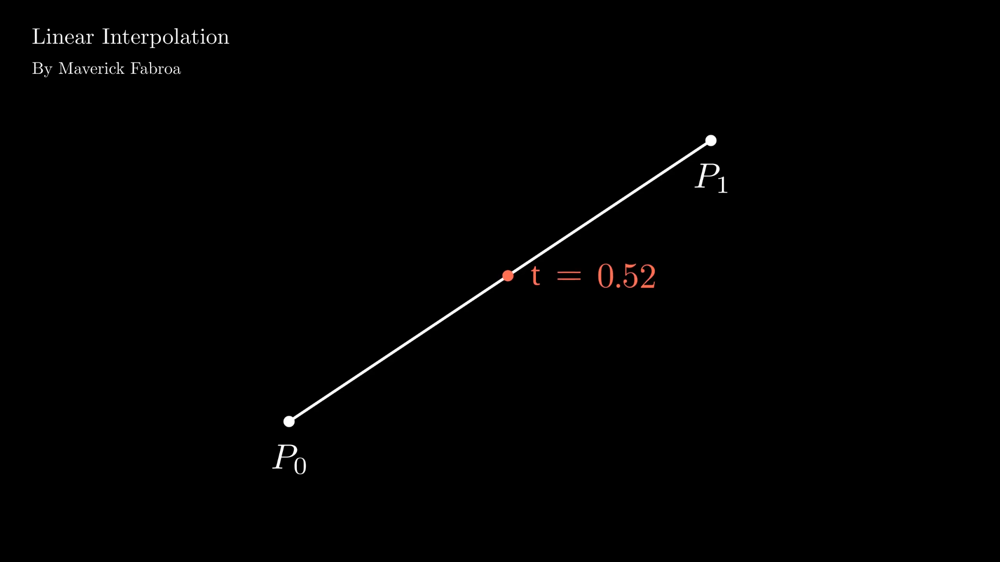

# Notebooks
Compilation of my Jupyter Notebook programs

## 1. AVL Tree Explaination
This notebook is a simple explaination of AVL Tree. It is a self-balancing Binary Search Tree (BST) where the difference between heights of left and right subtrees cannot be more than one for all nodes.

## 2. Linear Interpolation
This notebook is a simple explaination of Linear Interpolation. It is a method of curve fitting using linear polynomials to construct new data points within the range of a discrete set of known data points.

## 3. Linear Regression
This notebook is a simple Linear regression which is a statistical method that allows us to summarize and study relationships between two continuous (quantitative) variables:
- One variable, denoted x, is regarded as the predictor, explanatory, or independent variable.
- The other variable, denoted y, is regarded as the response, outcome, or dependent variable.

## Libraries Used

All the programs are written in Python and uses these libraries:

1. [Manim](https://www.manim.community) library for animation. Manim is an animation engine for explanatory math videos dveloped by **Grant Sanderson** better known as [3Blue1Brown](https://www.youtube.com/c/3blue1brown).

2. [PyTorch](https://pytorch.org) library for machine learning. PyTorch is an open source machine learning library based on the Torch library, used for applications such as computer vision and natural language processing, primarily developed by Facebook's AI Research lab (FAIR).

## Author

* **[mavyfaby](https://github.com/mavyfaby)** - Maverick Fabroa
